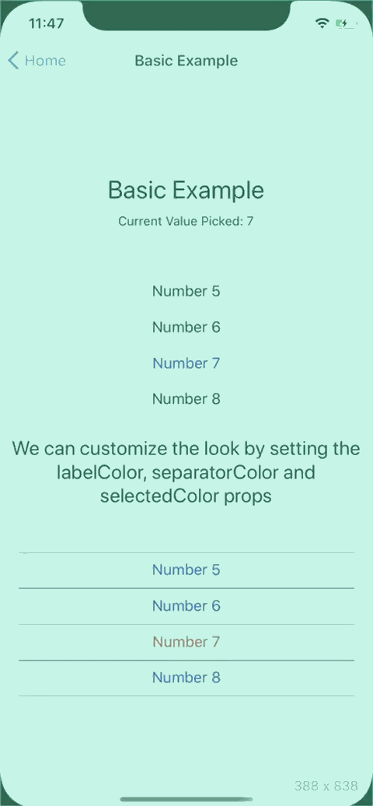
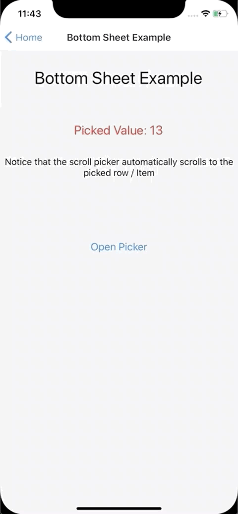

# react-native-value-picker

Cross-Platform iOS style picker for react native.

Small, Performant

The Native picker on Android is a modal / dropdown design which is vastly different from the native iOS picker. In my current project we wanted a design more similar to the iOS native picker, and thus I created this Scroll Picker as a replacement on Android, but it works equally well on iOS for instance as an alternative to [@react-native-community/picker](https://github.com/react-native-community/react-native-picker) native iOS picker module.

### Examples

| Basic Example                                | Bottom Sheet Example                                       |
| -------------------------------------------- | ---------------------------------------------------------- |
|  |  |

### Install into project

```
yarn add react-native-value-picker
```

**import and usage**

```
import {ScrollPicker} from 'react-native-value-picker';

        ...

        <ScrollPicker
          // We need to tell the picker the current picked value
          currentValue={pickedValue}
          // The picker is a pure component so we need to tell it
          // what data it needs to subscribe to, otherwise it won't
          // re-render
          extraData={pickedValue}
          // The array of objects which makes up the list
          list={MOCK_DATA}
          // Callback function to update the picked value
          onItemPress={setPickedValue}
          // Changes the text color in the list
          labelColor="blue"
          // Changes color of the row separator in the list
          separatorColor="purple"
          // Changes color of the text of the picked item in the list
          selectedColor="red"
        />

        ...
```

**Picker List Data Structure**

the list prop requires an array of Objects according to the below structure.

- value: the API value
- label: the text rendered into the picker list.

```
export const MOCK_DATA = [
  {
    value: 1,
    label: 'Number 1',
  },
  {
    value: 2,
    label: 'Number 2',
  },
  {
    value: 15,
    label: 'Number 15',
  },
  {
    value: 16,
    label: 'Number 16',
  },
];
```

### Run the examples Locally

Clone project

```
git clone https://github.com/ugglr/react-native-value-picker.git
```

move into the examples folder.

```
cd react-native-value-picker && cd examples
```

in examples root

```
yarn
```

**iOS**
Install pods and go back to examples root

```
cd ios && pod install && cd ..
```

Run react native

```
yarn run ios
```

**Android**
run react native in examples root

```
yarn run android
```

### ScrollPicker Props

| Prop             | Description                                                                                                                                                                                                                                                   |
| ---------------- | ------------------------------------------------------------------------------------------------------------------------------------------------------------------------------------------------------------------------------------------------------------- |
| `currentValue`   | Tells the picker the current picked value                                                                                                                                                                                                                     |
| `extraData`      | The underlying RN component which creates the list is FlatList. Which means, as a FlatList it is a pure component and won't re-render, unless it subscribes to a piece of data that will trigger a re-render.                                                 |
| `list`           | The array of objects which makes up the list. Each Object in the Array needs to have a value-field, and a label-field. Value is the API value which the developer needs to user to pick. Label is the verbose friendly String which is displayed to the user. |
| `onItemPress`    | Callback which get's executed when user presses an Item in the picker list.                                                                                                                                                                                   |
| `labelColor`     | Changes the un-picked text color of the Items in the list                                                                                                                                                                                                     |
| `separatorColor` | Changes color of the separator lines between the Items in the list.                                                                                                                                                                                           |
| `selectedColor`  | Changes the picked Item text color                                                                                                                                                                                                                            |

### Example Code

**BasicExample.js**

```
import React, {useState} from 'react';
import {View, Text, StyleSheet} from 'react-native';

import {ScrollPicker} from 'react-native-value-picker';

import {MOCK_DATA} from './mockData';

function BasicExample() {
  const [pickedValue, setPickedValue] = useState(7);

  return (
    <View style={styles.Container}>
      <Text style={styles.Title}>Basic Example</Text>
      <Text>Current Value Picked: {pickedValue}</Text>

      <View style={styles.PickerContainer}>
        <ScrollPicker
          currentValue={pickedValue}
          extraData={pickedValue}
          list={MOCK_DATA}
          onItemPress={setPickedValue}
        />
      </View>
      <Text style={{fontSize: 22, textAlign: 'center'}}>
        We can customize the look by setting the labelColor, separatorColor and
        selectedColor props
      </Text>
      <View style={styles.PickerContainer}>
        <ScrollPicker
          // We need to tell the picker the current picked value
          currentValue={pickedValue}
          // The picker is a pure component so we need to tell it
          // what data it needs to subscribe to, otherwise it won't
          // re-render
          extraData={pickedValue}
          // The array of objects which makes up the list
          list={MOCK_DATA}
          // Callback function to update the picked value
          onItemPress={setPickedValue}
          // Changes the text color in the list
          labelColor="blue"
          // Changes color of the row separator in the list
          separatorColor="purple"
          // Changes color of the text of the picked item in the list
          selectedColor="red"
        />
      </View>
    </View>
  );
}

const styles = StyleSheet.create({
... see example file for styles ...
});

export default BasicExample;

```

**Bottom Sheet Example**

> Note:
> The bottom sheet component is not included in the package. I'm using [react-native-raw-bottom-sheet](https://github.com/nysamnang/react-native-raw-bottom-sheet)

```
import React, {useRef, useState} from 'react';
import {View, Text, Button, StyleSheet} from 'react-native';
import RBSheet from 'react-native-raw-bottom-sheet';

import {ScrollPicker} from 'react-native-value-picker';

import {MOCK_DATA} from './mockData';

function BottomSheetExample() {
  const [pickedValue, setPickedValue] = useState(7);
  const refRBSheet = useRef();

  return (
    <View style={styles.Container}>

    ...

      <RBSheet
        ref={refRBSheet}
        closeOnDragDown={true}
        closeOnPressMask={true}
        height={300}
        customStyles={{
          draggableIcon: {
            backgroundColor: '#000',
          },
          container: {
            borderRadius: 12,
          },
        }}>
        {/* Start of Scroll Picker */}
        {/*
            The underlying FlatList is not wrapped with a View.
            So to align it in the sheet I wrap the picker and control
            the positioning. I like that approach because devs has full control
            over how the picker is placed & aligned.
        */}
        <View style={styles.SheetView}>
          <ScrollPicker
            // We need to tell the picker the current picked value
            currentValue={pickedValue}
            // The picker is a pure component so we need to tell it
            // what data it needs to subscribe to, otherwise it won't
            // re-render
            extraData={pickedValue}
            // The array of objects which makes up the list
            list={MOCK_DATA}
            // Callback function to update the picked value
            onItemPress={setPickedValue}
          />
        </View>
        {/* End of Scroll Picker */}
      </RBSheet>
    </View>
  );
}

const styles = StyleSheet.create({
... see the example file for styles ...
});

export default BottomSheetExample;

```
